<!--
  Profile — Abdelmoumene Hamza Ayoub
  A typeset "technical dossier". Every visual below is a self-contained animated
  SVG (pure SVG/SMIL, no JavaScript, no third-party stat services). The files are
  generated by scripts/ and the contribution ledger refreshes daily via Actions.
  Theme-aware: dark-mode viewers get warm "vellum", light-mode get "bond".
    scripts/make_banner.py         -> banner-vellum.svg  / banner-bond.svg   (static)
    scripts/fetch_contributions.py -> data/contributions.json                (daily)
    scripts/render_heatmap_svg.py  -> heatmap-vellum.svg / heatmap-bond.svg  (daily)
-->

<a href="https://github.com/hamza-abdelmoumene">
  <picture>
    <source media="(prefers-color-scheme: dark)"  srcset="banner-vellum.svg">
    <source media="(prefers-color-scheme: light)" srcset="banner-bond.svg">
    
  </picture>
</a>

  

<picture>
  <source media="(prefers-color-scheme: dark)"  srcset="heatmap-vellum.svg">
  <source media="(prefers-color-scheme: light)" srcset="heatmap-bond.svg">
  
</picture>

  

<picture>
  <source media="(prefers-color-scheme: dark)"  srcset="https://raw.githubusercontent.com/hamza-abdelmoumene/hamza-abdelmoumene/output/snake-vellum.svg">
  <source media="(prefers-color-scheme: light)" srcset="https://raw.githubusercontent.com/hamza-abdelmoumene/hamza-abdelmoumene/output/snake-bond.svg">
  
</picture>

  

  <b>Abdelmoumene Hamza Ayoub</b> &nbsp;·&nbsp; Machine Learning &amp; Applied Data Science &nbsp;·&nbsp; ESI Algiers, Algeria
    
  <a href="https://github.com/hamza-abdelmoumene">GitHub</a> &nbsp;·&nbsp;
  <a href="mailto:ph_abdelmoumene@esi.dz">Academic mail</a> &nbsp;·&nbsp;
  <a href="mailto:hamzaayoub.abdelmoumene@gmail.com">Personal mail</a> &nbsp;·&nbsp;
  <a href="https://www.esi.dz/">ESI</a>

  

<i>Every panel here is a hand-built animated SVG — no third-party stat widgets, no tracking, no JavaScript. The contribution ledger regenerates daily from public data via GitHub Actions.</i>

