<!--
  Profile — Abdelmoumene Hamza Ayoub
  A typeset "technical dossier". Every visual below is a self-contained animated
  SVG (pure SVG/SMIL, no JavaScript, no third-party stat services). The files are
  generated by scripts/ and the contribution ledger refreshes daily via Actions.
  Theme-aware: dark-mode viewers get an aged "dark ledger", light-mode aged "paper".
    scripts/make_banner.py         -> banner-dark.svg   / banner-light.svg   (static)
    scripts/make_worklog.py        -> worklog-dark.svg  / worklog-light.svg  (static)
    scripts/fetch_contributions.py -> data/contributions.json                (daily)
    scripts/render_heatmap_svg.py  -> heatmap-dark.svg  / heatmap-light.svg  (daily)
-->

<a href="https://github.com/hamza-abdelmoumene">
  <picture>
    <source media="(prefers-color-scheme: dark)"  srcset="banner-dark.svg">
    <source media="(prefers-color-scheme: light)" srcset="banner-light.svg">
    
  </picture>
</a>

  

<picture>
  <source media="(prefers-color-scheme: dark)"  srcset="worklog-dark.svg">
  <source media="(prefers-color-scheme: light)" srcset="worklog-light.svg">
  
</picture>

  

<picture>
  <source media="(prefers-color-scheme: dark)"  srcset="heatmap-dark.svg">
  <source media="(prefers-color-scheme: light)" srcset="heatmap-light.svg">
  
</picture>

  

  <b>Abdelmoumene Hamza Ayoub</b> — Machine Learning &amp; Applied Data Science student at ESI Algiers. 
  I build fast, Linux-first tools and turn raw data into clear, reliable insight.

  

  <b>Selected work</b> &nbsp;·&nbsp;
  <a href="https://github.com/hamza-abdelmoumene/vespera">vespera</a> &nbsp;·&nbsp;
  <a href="https://github.com/hamza-abdelmoumene/lyrics-tool">lyrics-tool</a> &nbsp;·&nbsp;
  <a href="https://github.com/hamza-abdelmoumene/math-algorithms-toolkit">math-algorithms-toolkit</a> &nbsp;·&nbsp;
  <a href="https://github.com/hamza-abdelmoumene/adds-set-theory">adds-set-theory</a>
    
  <a href="https://github.com/hamza-abdelmoumene">GitHub</a> &nbsp;·&nbsp;
  <a href="mailto:ph_abdelmoumene@esi.dz">Academic mail</a> &nbsp;·&nbsp;
  <a href="mailto:hamzaayoub.abdelmoumene@gmail.com">Personal mail</a> &nbsp;·&nbsp;
  <a href="https://www.esi.dz/">ESI</a>

  

<i>Every panel here is a hand-built animated SVG — no third-party stat widgets, no tracking, no JavaScript. The contribution ledger regenerates daily from public data via GitHub Actions.</i>

