<!--
  Profile README — Abdelmoumene Hamza Ayoub
  Hero banner: hand-built animated SVG (pure SVG/SMIL, no JavaScript) — dark.svg / light.svg
  It auto-switches with the viewer's GitHub theme via the <picture> element below.
-->

<div align="center">
  <a href="https://github.com/hamza-abdelmoumene">
    <picture>
      <source media="(prefers-color-scheme: dark)"  srcset="dark.svg">
      <source media="(prefers-color-scheme: light)" srcset="light.svg">
      
    </picture>
  </a>
</div>

<p align="center">
  <a href="https://www.esi.dz/"></a>
  
  <a href="mailto:ph_abdelmoumene@esi.dz"></a>
  <a href="mailto:hamzaayoub.abdelmoumene@gmail.com"></a>
  
</p>

<br>

## About

I'm a Computer Science student at **ESI Algiers**, working in **machine learning** and **applied data science**. I like turning raw data into clear, reliable insight — and building fast, no-nonsense tools to get there.

```text
Focus        Machine learning · data pipelines · efficient CLI tooling
Foundations  Algorithms · data structures · data engineering
Environment  Linux-first development · system internals
Currently    Data manipulation & visualization with pandas and matplotlib
```

<br>

## Tech Stack

<p align="center">
  
  
  
  
  
  
  
  
  
  
  
</p>

<br>

## GitHub Activity

<div align="center">
  
  
</div>

<div align="center">
  
</div>

<div align="center">
  
</div>

<div align="center">
  
</div>

<br>

## Connect

<p align="center">
  <a href="https://github.com/hamza-abdelmoumene"></a>
  <a href="mailto:ph_abdelmoumene@esi.dz"></a>
  <a href="https://www.esi.dz/"></a>
</p>

<div align="center">
  <sub>Hero banner is a hand-built animated SVG — pure SVG/SMIL, no JavaScript, theme-aware.</sub>
</div>
