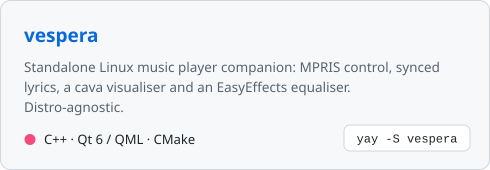
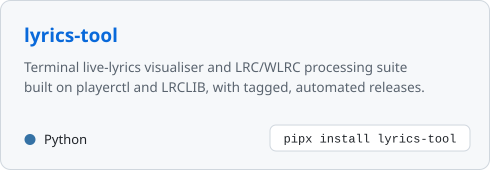
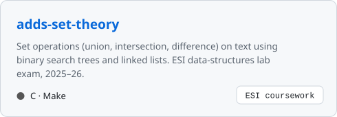
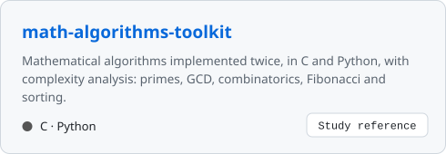

<!-- Every image here is a static dark/light SVG pair generated by scripts/make_art.py -->
<picture>
  <source media="(prefers-color-scheme: dark)" srcset="header-dark.svg">
  <source media="(prefers-color-scheme: light)" srcset="header-light.svg">
  
</picture>

I'm a second-year computer science student at the
[École nationale Supérieure d'Informatique (ESI)](https://www.esi.dz/) in Algiers, working
towards AI engineering: machine learning, backend systems and deployment. Outside
coursework I build and maintain open-source tools for Linux.

## Education

**ESI Algiers**, Ingénieur d'État en informatique (state engineering degree in computer science), 2025–present
- Preparatory cycle, English-medium programme; now in the second year (2CP).
- 2CP coursework: computer architecture, file structures and external data structures,
  object-oriented programming (Java), linear algebra, probability and statistics,
  series and multivariable analysis, databases, information systems, mathematical logic,
  graph algorithms and linear optimisation.

**GCI World 2026**, University of Tokyo, Matsuo–Iwasawa Lab
- Data science and machine learning programme, September 2026 cohort.

## Projects

<a href="https://github.com/hamza-abdelmoumene/vespera"><picture><source media="(prefers-color-scheme: dark)" srcset="card-vespera-dark.svg"><source media="(prefers-color-scheme: light)" srcset="card-vespera-light.svg"></picture></a>
<a href="https://github.com/hamza-abdelmoumene/lyrics-tool"><picture><source media="(prefers-color-scheme: dark)" srcset="card-lyrics-tool-dark.svg"><source media="(prefers-color-scheme: light)" srcset="card-lyrics-tool-light.svg"></picture></a>

<a href="https://github.com/hamza-abdelmoumene/adds-set-theory"><picture><source media="(prefers-color-scheme: dark)" srcset="card-adds-set-theory-dark.svg"><source media="(prefers-color-scheme: light)" srcset="card-adds-set-theory-light.svg"></picture></a>
<a href="https://github.com/hamza-abdelmoumene/math-algorithms-toolkit"><picture><source media="(prefers-color-scheme: dark)" srcset="card-math-algorithms-toolkit-dark.svg"><source media="(prefers-color-scheme: light)" srcset="card-math-algorithms-toolkit-light.svg"></picture></a>

## Currently

- Following the GCI World 2026 programme alongside 2CP.
- Working through *Mathematics for Machine Learning* (Deisenroth, Faisal, Ong) and
  practising data analysis with pandas and scikit-learn.
- Maintaining vespera and lyrics-tool on the AUR and PyPI.

## Tools

<picture><source media="(prefers-color-scheme: dark)" srcset="stack-dark.svg"><source media="(prefers-color-scheme: light)" srcset="stack-light.svg"></picture>

## Contact

- Academic: [ph_abdelmoumene@esi.dz](mailto:ph_abdelmoumene@esi.dz)
- Personal: [hamzaayoub.abdelmoumene@gmail.com](mailto:hamzaayoub.abdelmoumene@gmail.com)
