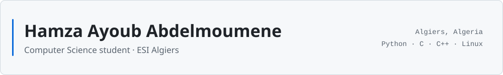

<!-- Header: scripts/make_header.py -> header-dark.svg / header-light.svg -->
<picture>
  <source media="(prefers-color-scheme: dark)" srcset="header-dark.svg">
  <source media="(prefers-color-scheme: light)" srcset="header-light.svg">
  
</picture>

I'm a second-year computer science student at the
[École nationale Supérieure d'Informatique (ESI)](https://www.esi.dz/) in Algiers, working
towards AI engineering: machine learning, backend systems and deployment. Outside
coursework I build and maintain open-source tools for Linux.

## Education

**ESI Algiers**, Ingénieur d'État en informatique (state engineering degree in computer science), 2025–present
- Preparatory cycle, English-medium programme; now in the second year (2CP).
- 2CP coursework: computer architecture, file structures and external data structures,
  object-oriented programming (Java), linear algebra, probability and statistics,
  series and multivariable analysis, databases, information systems, mathematical logic,
  graph algorithms and linear optimisation.

**GCI World 2026**, University of Tokyo, Matsuo–Iwasawa Lab
- Data science and machine learning programme, September 2026 cohort.

## Projects

| Project | Description | Stack | Install |
|---|---|---|---|
| [**vespera**](https://github.com/hamza-abdelmoumene/vespera) | Standalone Linux music player companion: MPRIS control, synced lyrics, cava visualiser and an EasyEffects equaliser. Distro-agnostic. | C++, Qt 6 / QML, CMake | `yay -S vespera` |
| [**lyrics-tool**](https://github.com/hamza-abdelmoumene/lyrics-tool) | Terminal live-lyrics visualiser and LRC/WLRC processing suite, built on playerctl and LRCLIB. Released on PyPI with tagged, automated releases. | Python | `pipx install lyrics-tool` |
| [**adds-set-theory**](https://github.com/hamza-abdelmoumene/adds-set-theory) | Set operations (union, intersection, difference) on text using binary search trees and linked lists. ESI data-structures lab exam, 2025–26. | C, Make | |
| [**math-algorithms-toolkit**](https://github.com/hamza-abdelmoumene/math-algorithms-toolkit) | Fundamental algorithms implemented from scratch: primes, GCD, Fibonacci, factorials, sorting. | C | |

## Currently

- Following the GCI World 2026 programme alongside 2CP.
- Working through *Mathematics for Machine Learning* (Deisenroth, Faisal, Ong) and
  practising data analysis with pandas and scikit-learn.
- Maintaining vespera and lyrics-tool on the AUR and PyPI.

## Tools

**Languages:** Python, C, C++, Java, QML, Bash, SQL 
**Data and ML:** NumPy, pandas, scikit-learn, Matplotlib, Jupyter 
**Environment:** Arch Linux, Git, Qt 6, CMake, GitHub Actions

## Contact

- Academic: [ph_abdelmoumene@esi.dz](mailto:ph_abdelmoumene@esi.dz)
- Personal: [hamzaayoub.abdelmoumene@gmail.com](mailto:hamzaayoub.abdelmoumene@gmail.com)
